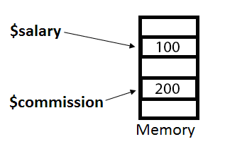
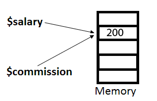

# PHP / MySQL
## Functions

*Pre-requisites: lesson 7*

*ECV Digital - 3/12/2015*

---
## Values and references
Before exploring functions, a little recap on values and references:
- Values are of one of the following native types (boolean, int, float, string)
- Variables are a reference for a values in memory
- Variables **`holds`** a value

> the PHP reference operator is the **`&`**

--
## Values and references
By default, the **`assignment`** operators work by value

**It copy the value of one expression to another**

```php
<?php
$salary = 100;
$commission = $salary;
$commission = 200;
echo $salary; // Outputs 10
?>
```

--
## Values and references
We can also use the **`assignment`** operator with reference!

**both variables will then target the exact same value in memory**
```php
<?php
$salary = 100;
$commission = &$salary;
$commission = 200;
echo $salary; // Outputs 20
?>
```


---
# Functions
> Function is the ability to encapsulate any piece of code in such a way that it can be called again and again.
 
```php
<?php
function functionName() {
  // ... code
}
?>
```

PHP function names are **NOT** case-sensitive. This is why php developpers used to write functions using only `[a-z]` and `_`

--
## Returning Values
All functions in PHP return a value even if you don’t explicitly cause them to: PHP will  return NULL as default.

To specify the return value of your function, use the `return` keyword

```php
<?php
function yo() {
  return "Yo World"; // No output is shown
}
$txt = yo();// Assigns the return value "Yo World" to $txt
echo $txt; // Displays "Yo World"
?>
```

--
## Returning Values

A return statement interrupt the execution of a function and can be placed anywhere. You can also return no values
 
```php
<?php
function yo($who) {
  echo "Yo $who";
  if ($who == "World") {
    return; // Nothing else in the// function will be processed
  }
  echo ", how are you";
}
  
yo("World"); // Displays "Yo World"
yo("Dude") // Displays "Yo Dude, how are you?"
?>
```

--
## Returning References
Functions can also be declared so that they return by reference

This allows you to return a variable as the result of the function, instead of a copy (returning a copy is the default for every data type except objects). 

Typically, this is used for things like [resources](http://php.net/manual/fr/resource.php) <!-- .element: target="_blank" -->

```php
<?php
function &byReference($file) { // Notice the &
  $bz = bzopen($file, "r");
  return $bz;
}
?>
```

--
## Returning References: caveat
You must return a variable:
- You cannot return an expression by reference
- You cannot use an empty return statement

```php
<?php
// This is incorrect and will cause PHP to emit a notice when called.
function &getYo() {
  return "Yo World";
}
?>
```

---
## Variable Scope
PHP has three variable scopes: 
- global scope (available to all parts of the script)
- class scope. (Won't be discussed in this course)
- function scope (completely isolated)

--
## Variable Scope
Any time you enter a function, PHP creates a new scope (a “clean slate”) that, by default, contains no variable and is completely isolated from the global scope:

Any variable defined within a function is no longer available after the function has finished executing.
```php
<?php
$a = "Yo World";
function yo() {
  $b = "How are you";
  echo $a;
} 
yo(); // → emit a notice, a is undefiend
echo $a; // → Yo World
echo $b; // → emit a notice, b is undefiend
?>
```

--
## Accessing the global scope
There are two ways to access variables in the global scope from inside a function:

You can "import" the variable inside the function’s scope by using the global statement
```php
<?php
$a = "Yo";
$b = "World";
function yo() {
   global $a, $b;
   echo "$a $b";
}
yo(); // → "Yo World"
?>
```

--
## Accessing the global scope
There are two ways to access variables in the global scope from inside a function:

You can use the $GLOBALS superglobal array
```php
<?php
$a = "Yo";
$b = "World";
function yo() {
   echo $GLOBALS['a'] .' '. $GLOBALS['b'];
}
yo(); // → "Yo World"
?>
```

---
## Passing Arguments
Arguments allow you to inject an arbitrary number of values into a function in order to influence its behaviour

You can define any number of arguments and, you can pass an arbitrary number of arguments to a function, regardless of how many you specified in its declaration

```php
<?php
function yo($who) {
  echo "Yo $who";
}
yo("World", "ho yeah!"); // → "Yo World"
// The last argument is just ignored
?>
```

-- 
## Optional argument
You can make arguments optional by giving them a default value (`expressions` are not allowed)

```php
<?php
function yo($who = "World") {
  echo "Yo $who";
}
yo(); // → "Yo World"
yo("Dude"); // → "Yo Dude"
?>
```

--
## Type-hinting
Type-hinting occurs when a function specifies what type of data must be passed in. 

Because PHP is loosely typed, you can specify either one of:
- Any class or interface name - the value must be of that class, or a sub- class of it, or implement that interface.
- Array - the value must be an array. Introduced in PHP 5.1.
- Callable - the value must be a valid callback 

--
## Type-hinting

```php
<?php
// default value must be null with type-hinting
function yo(array $dudes = null) { 
  // $dudes can be nothing or must be an array
}
function yoyo(PDO $obj, Callable $callback) {
  // $obj must be compatible with the PDO object
  // $callback must be a valid callback (a function)
}
?>
```
More information on the [`Callable` type](http://php.net/manual/en/language.types.callable.php) <!-- .element: target="_blank" -->

--
## Passing Arguments by Reference
Function arguments can also be passed by reference, by prefixing them with the by-reference operator &. 

This allows your function to affect external variables.

```php
<?php
function countVal($count) {
  $count += 1;
}
function countRef(&$count) { // Notice the &
  $count += 1;
}
$count = 0;
countVal($count);
echo $count; // → 0
countRef($count);
echo $count; // → 1
?>
```
 
--
## Variadics
Variadics allow you to explicitly denote a function as accepting a variable length argument list

The syntax for variadics is an argument variable prefixed with three periods: **`...$args`**

```php
<?php
function f(...$args) {
  $count = 0;
  foreach ($args as $arg) { $count += strlen($arg); }
  return $count;
}
echo f("hop", "hop", "woohoo"); // → 12
function foo(&...$args) { // variadics allows for passing by reference:
    // each argument is passed by reference
}
function bar(array ...$args) { // variadics allows for type-hinting
  // each argument is an array
}
?>
```
--
## Argument Unpacking
The same syntax as the variadics can be used for argument unpacking or “splat”

It allows you to unpack an array-like data structure into an argument list when calling a function or method

```php
<?php
function f(...$args) {
  $count = 0;
  foreach ($args as $arg) { $count += strlen($arg); }
  return $count;
}
$splatting = ["hop", "hop", "woohoo"];
echo f(...$splatting); // → 12
?>
```

**Array unpacking works with any function, but must be the last argument passed in**

---
## Anonymous Functions
Anonymous functions are created simply by defining a function with no name, and assigning it to a variable:
```php
<?php
$anonFunc = function($who) {
  echo "Yo $who";
}
?>
```

You then call an anonymous function in the same way you would a regular function, using the variable instead of its name:
```php
<?php
$anonFunc("Dude"); // → "Yo Dude"
?>
```

--
## Closures
In PHP a function encapsulates its scope, but it is possible to inherit variables from the parent scope into the closure with the use keyword:

```php
<?php
function createYo($who) {
  return function() use ($who) {// Access the parent scope by-value
      echo "Yo $who"; // You can access the variable $who
  };
}
$who = "dude";
$yo = createYo($who); // Passed in by-value
$yo(); // → Yo dude
$who = "Dude!!!";
$yo(); // → Yo dude
?>
```
Our closure access the variable by value: a copy is made available inside the closure using its original name.

--
## Closures, values and references
It is also possible to access the variables by-reference

```php
<?php
function createYo(&$who) { // Notice the &
  return function() use (&$who) { // Notice the &
    echo "Yo $who";
    $who = null;
  }; 
}
$who = "dude";
$yo = createYo($who); // Passed in by-reference
$yo(); // → Yo dude
$who = "Dude!!!";
$yo(); // → Yo Dude!!!
?>
```

---
## Callbacks
PHP supported multiple types of callbacks:
- A string containing a valid function name
```php
<?php
$callback = "myFunction";
usort($array, $callback);
?>
```
- You can also use arrays to denote object or static class method calls:
```php
<?php
// object method call:
$callback = [$obj, 'method']; // $obj->method() callback
usort($array, $callback);
// or static method:
$callback = ['SomeClass', 'method']; // SomeClass::method()
usort($array, $callback);
?>
```

--
## Callable Type
A callable is anything that can be called. In PHP, we can call things by using the two braces **`()`**
```php
<?php
  // Named function
  function myFunction() { };
  myFunction();
  // Variable Functions
  $callable = "myFunction";
  $callable();
  // object method call:
  $callable = [$obj, 'method']; // $obj->method() callable
  $callable();
  // Anonymous function
  $callable = function() { }
  $callable();
  // Closure
  $callable = function() use ($var) { }
  $callable();
?>
```

---
## Project: simple blog
Using ALL the knowledge so far, implement a very simple blogging system

Some guidelines are given on the next slides.

--
## Implement a post view
Implement a better php view system
- Create folder call views
- Create a layout.php file containing yout html Layout
- Put all your views inside their own php file
- Implement to load those views inside the layout from anywhere in your application

--
## Templates
Allow users to create post based on templates

