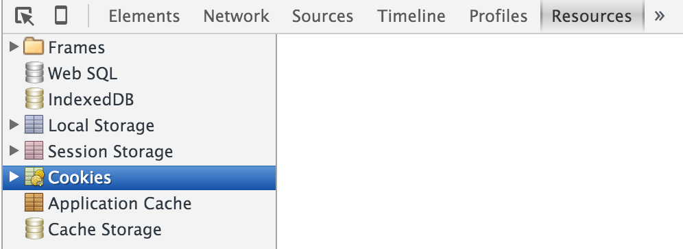

# PHP / MySQL
*ECV Digital - 22/10/2015*

**Pre-requisites: lesson 1**

---
# A little more of GIT
Before we start we need to setup your git repo:

Follow the github [fork guide](https://help.github.com/articles/fork-a-repo/) <!-- .element: target="_blank" -->and fork my repo: https://github.com/morgangiraud/ecvd-php <!-- .element: target="_blank" -->

---
# PHP -  Workflow
Where does PHP code is executed  and by what?
- On server side! <!-- .element: class="fragment" -->
- By a PHP Interpreter! <!-- .element: class="fragment" -->

What do you need to access your php code? <!-- .element: class="fragment" -->
- You need a webserver! (like Nginx, Apache) <!-- .element: class="fragment" -->

--
# Main PHP Job
Browsers(clients) can send request to servers. What is the main job of our php script which receive this request thanks to the webserver?
> To transform our request into a response. 

<!-- .element: class="fragment" -->

--
# Simple workflow 
- The browser sends a request <!-- .element: class="fragment" -->
- The webserver receives a request, parses it and transfers it to a PHP Interpreter <!-- .element: class="fragment" -->
- PHP Interpreter executes a PHP script with the request and return a response to the webserver <!-- .element: class="fragment" -->
- The webserver sends back the response to the browser <!-- .element: class="fragment" -->

> Everything is [stateless](https://en.wikipedia.org/wiki/Stateless_protocol) <!-- .element: target="_blank" -->!

<!-- .element: class="fragment" -->
--
# Dig deeper
[Here](http://abhinavsingh.com/how-does-php-echos-a-hello-world-behind-the-scene/) is a more complete description of the process involving php and apache <!-- .element: target="_blank" -->

---
# PHP builtin webserver
PHP has a [built'in webserver](http://php.net/manual/en/features.commandline.webserver.php) <!-- .element: target="_blank" -->
```bash
php -S localhost:8000
```
- Usefull for very fast prototyping
- **Not Suitable for big project or production**

--
# Exercice
Serve a simple login page thanks to the builtin webserver
  - Create a basic webpage `index.html`
  - Launch the webserver
  - Access it thanks to your browser

---
# Super Globals
What are [super globals](http://php.net/manual/en/language.variables.superglobals.php)? <!-- .element: target="_blank" -->
What are they used for?
- For example, you can use them to get some form data


--
# Exercice
Write a simple form to login and access data on the php side
  - Change your `index.html` into an `index.php` file and add a login form to it
  - Find the way to access data thanks to superglobals
  - When you receive the data, validate it against hardcoded credentials and show a different page

--
# Persistence
What happens if you access again your webpage?
> Not anymore logged in! 

<!-- .element: class="fragment" -->

Why? <!-- .element: class="fragment" -->
> No processus has been created to track the user.  

<!-- .element: class="fragment" -->

Remember that webservers are mostly stateless! <!-- .element: class="fragment" -->

---
# Sessions
What is a session? How can you access it? What is the client side equivalent?

[Here](https://crypto.stanford.edu/cs142/lectures/cookie.html) is a good sumup of why and how session/cookies have been added to internet. <!-- .element: target="_blank" -->

--
# How to use session
Let's have a look at all the [sessions functions](http://php.net/manual/fr/ref.session.php)<!-- .element: target="_blank" -->

A focus on: `session_start, $_SESSION, session_destroy`

Every PHP page must start, on the first line with:
```PHP
<?php
session_start();
?>

```
<!-- .element: class="fragment" -->
After you started the session, the `$_SESSION` wiil be populated with the current session data. 

<!-- .element: class="fragment" -->
Finnaly, you can kill a session using `session_destroy();` 

<!-- .element: class="fragment" -->

--
# Exercice
Add some persistence to your login system and a logout system
- Start your session
- When the user logged in, store those information inside the session
- Check that you can reload the page and still being logged in
- Display a logout link and redirect once unlogged to the index page

---

# Cookie?
Let's open the Chrome console and analyse what happens on the browser side
- Type `CMD + alt + i` (OSX) to show the console and access cookies


--
# Cookie?
- Delete any existing cookie
- Remove the `session_start();` in your file and reload your page
- See that no cookie has been added
- Add back the `session_start();` call and reload your page
- See that now, you have a cookie

-- 
# Cookie?
PHP do the hard work of creating a cookie and linking it to a session for you.
You can find this link in the cookie named `PHPSESSID` by default.

Now, what would happend if you could get the content of that cookie from someone else ?

-- 
# Cookie thief!
Thanks to this little [plugin](https://chrome.google.com/webstore/detail/editthiscookie/fngmhnnpilhplaeedifhccceomclgfbg?hl=en) <!-- .element: target="_blank" --> you can edit your own cookie.
> First check that you lost your session if you edit your cookie

Now, steal someone else cookie!
- Access the webserver of another student
- Ask him to give you his `PHPSESSID` cookie value
- Edit your cookie `PHPSESSID` and change the value with his value
- Check that you're logged in with his account!

---
# Security
To prevent this kind of **session fixation** attack. Add a call right after all your `session_start();`
> `session_regenerate_id();`

---

# Homework
1. Write a register page that store the data inside a file called users.txt
2. Remove the hardcoded credentials you previously set
2. Check the data in your `users.txt` file in your login page to log users

> Help:
Look at all the PHP [filesystem functions](http://php.net/manual/en/book.filesystem.php) <!-- .element: target="_blank" -->